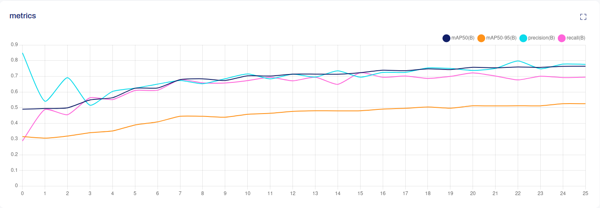
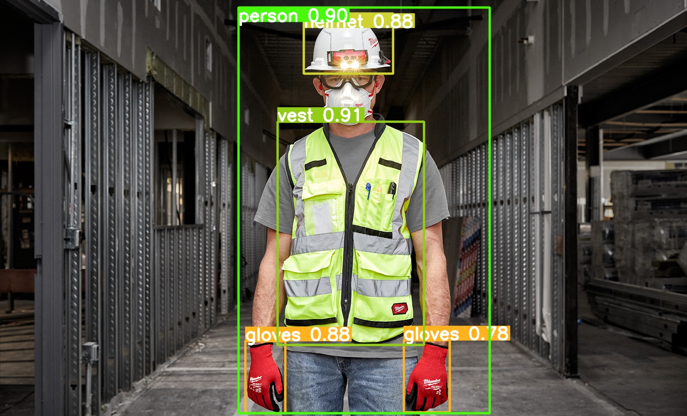

# Introduction
This project is a simple object detection app that detects people wearing PPE (Personal Protective Equipment) in images and videos. The app uses the YOLOv8 object detection algorithm to detect people wearing PPE in images and videos. The app is capable of detecting people wearing PPE in real-time and can be used to monitor compliance with safety regulations in factories, construction sites, and other workplaces.

# Algorithm Object Detection
The algorithm used for this app is <b>Yolov8</b>. YOLOv8 is a state-of-the-art, real-time object detection system that is capable of detecting 80 different objects in images and videos. It is a single-stage object detection system that uses a single neural network to predict bounding boxes and class probabilities directly from full images in one evaluation. YOLOv8 is a highly accurate and efficient object detection system that is capable of detecting objects in real-time. 

# Setup
To setup the project, follow the steps below:
- Clone the repository and install the required packages using the following command:
    ```bash
    git clone https://github.com/farizalmustaqim/TestSkill_Synapsis.git
    cd TestSkill_Synapsis
    ```
- Create a virtual environment and activate it using the following commands:
    ```bash
    python -m venv venv
    source venv/bin/activate
    ```
- Install the required packages using the following command:
    ```bash
    pip install -r requirements.txt
    ```

# Dataset
The dataset used for this task is the [PPE dataset](https://universe.roboflow.com/test-uooq1/ppe-factory-bmdcj) from Roboflow. The dataset contains 2190 images of people wearing PPE but augmented to 5532 images. 


# Training
The model was trained on the PPE dataset using the YOLOv8 architecture. I train this model on [Google Colab](https://colab.research.google.com/drive/1zQnXbsmLIbeuXCtNc5wc0gcmfUXvRbi1?usp=sharing) with 26 epochs. The model was trained on a single NVIDIA Tesla T4 GPU. The training took approximately 2 hours to complete.

# Evaluation
The model was evaluated on the PPE dataset using the YOLOv8 architecture. The model achieved an mAP of 0.5 on the test set. The model was evaluated on a single NVIDIA Tesla T4 GPU.<br>
The evaluation result can be seen in the following image:


# Inference
- For inference on a single image, run the following command:
    ```bash
    python detect.py --source path/to/image.jpg
    ```
    example:<br>
    ```bash
    python detect.py --source example/test1.jpg
    ```

- For inference on a video, run the following command:
    ```bash
    python detect.py --source path/to/video.mp4
    ```
    example:<br>
    ```bash
    python detect.py --source example/video_contoh.mp4
    ```

# Example Output




